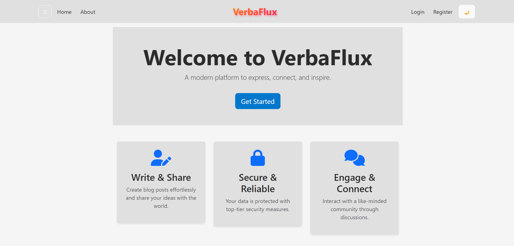
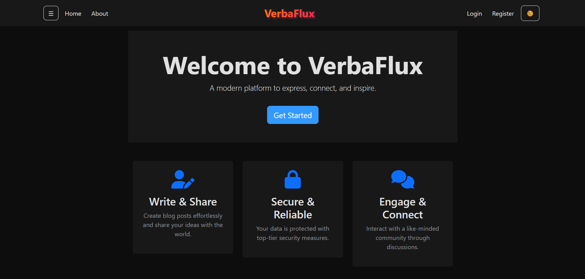

# VerbaFlux – A Modern Flask Blogging Platform

VerbaFlux is a sleek, responsive blogging platform built using Flask and Bootstrap 5. It allows users to create accounts, write posts, edit/delete them, and view others' blogs. The site features a clean UI that adapts beautifully to both light and dark modes.

---

## 🚀 Features

- ✅ User Authentication (Register, Login, Logout)
- 🖼️ Profile Image Uploads
- ✍️ Create, Update & Delete Posts
- 🌓 Light & Dark Mode Compatible
- ⚡ Flash Messaging for Alerts & Errors
- 🔒 Secure Password Hashing
- 📅 Timestamped Posts
- 📱 Fully Responsive (Mobile Friendly)
- 🎨 Custom Theming with Bootstrap 5 Variables

---

## 🛠️ Tech Stack

| Layer        | Technology     |
|--------------|----------------|
| Backend      | Python, Flask  |
| Frontend     | Bootstrap 5, HTML5, Jinja2 |
| Database     | SQLite (with SQLAlchemy ORM) |
| Auth         | Flask-Login    |
| Forms        | Flask-WTF      |
| Styling      | Custom CSS with Bootstrap Variables |

---

## 📸 Screenshots

| Light Mode | Dark Mode |
|------------|-----------|
|  |  |

---
